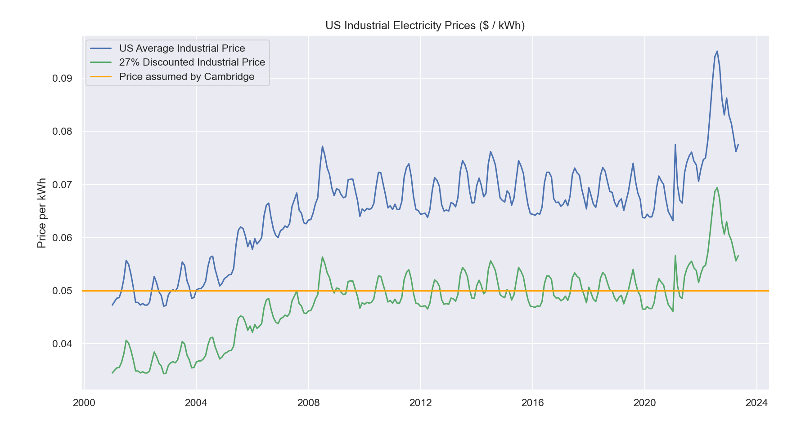
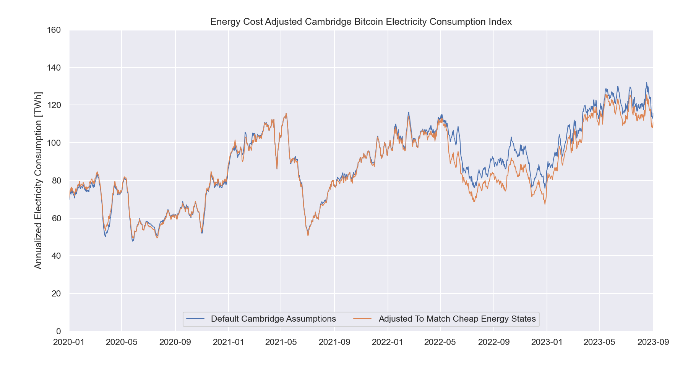

# Adjusting the Cambridge Bitcoin Electricity Consumption Index for US Energy Prices

The Cambridge Bitcoin Electricity Consumption Index is the gold standard of models for tracking the power utilization of the Bitcoin Network, but it is not without flaws. One of these flaws is the model's assumption of constant global electricity prices ($0.05 per kWh). In the current energy shortage, the world is faced with rapidly rising electricity prices and the model must be adjusted.

The attached Jupyter Notebook leverages data available from the US Energy Information Administration and the availability of CBECI data for various energy price assumptions to model the expected network power usage over time for the given price data. 

The data finds that although average US industrial electricity prices discounted by 27% to best-match the historic $0.05 per kWh assumption from Cambridge, has historically lined up well with the data, the values in 2022 differ dramatically, suggesting that the CBECI is currently overestimating the electricity demand that the network can support by as much as 16%.

## Limitations

- The CBECI data is only available at $0.01 increments, therefore energy price data in between these increments had to be linearly interpolated.
- The US Energy Information Administration data postings are generally a couple months delayed, so for recent estimates this script forward fills energy prices (assumes them to have not changed since the last data point), which makes the last couple months of data unstable and may also lose seasonal variations.